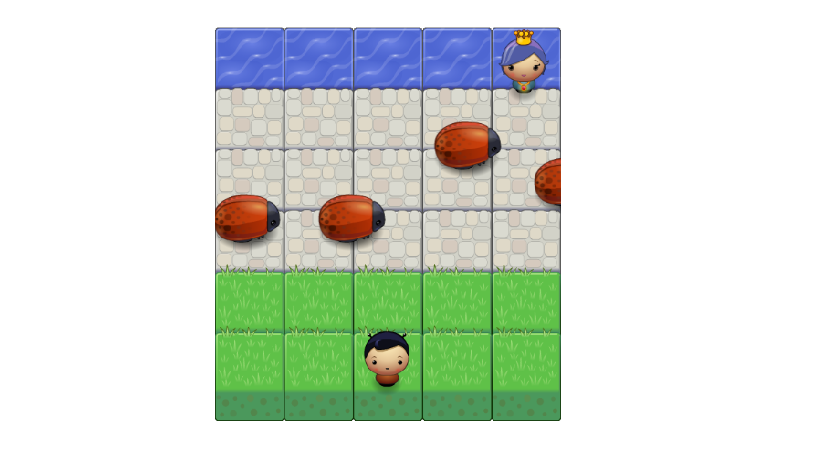

# Arcade Game Clone
###### Udacity Description

An HTML5 Canvas powered video game, developed using the best practices in Object Oriented JavaScript

[Live Site](http://cshields88.github.io/Udacity-FEND-Arcade-Game-Clone)

##### Directions:
--Use the arrow keys to move your player.
--Make it across the game board and save the princess to win!
--If you touch a bug you lose and are automatically reset to
  the starting position.

###### Resources Used:

--https://www.youtube.com/watch?v=knB1uzSdvJA
--https://www.youtube.com/watch?v=NZHzgXFKfuY
--https://www.youtube.com/watch?v=_plO60c5op0
--https://www.youtube.com/watch?v=rqEJ7WiLWdo
--https://www.youtube.com/watch?v=ydt3pBbk7bQ
--https://www.youtube.com/watch?v=OFzs4unxVtU

--http://www.lostdecadegames.com/how-to-make-a-simple-html5-canvas-game/
--http://blog.sklambert.com/html5-canvas-game-2d-collision-detection/
--https://www.google.com/search?q=html+5+canvas+game+reset+player&rlz=1CDGOYI_enUS611US612&oq=html+5+canvas+game+reset+player&aqs=chrome..69i57&sourceid=chrome-mobile&espv=1&ie=UTF-8&hl=en-US
